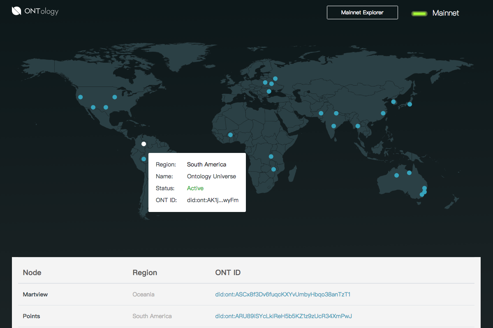

# Ontology node monitor

本体网络Ontology的节点信息监测站点。
> [Ontology Node Monitor Site](https://monitor.ont.io/)



## Build Setup

``` bash
# install dependencies
yarn install

# serve with hot reload at localhost:8080
yarn run dev

# build for production with minification
yarn run build
```
